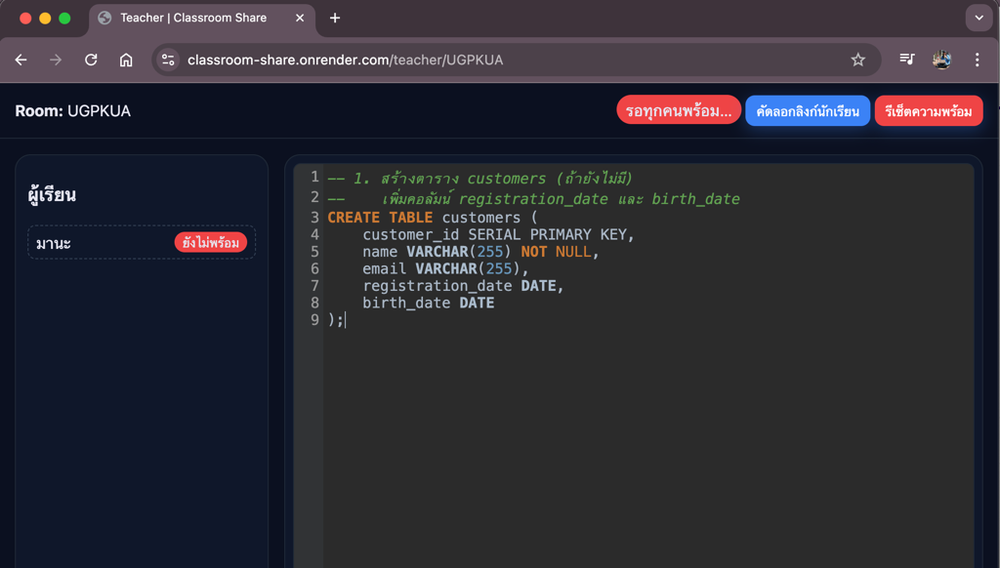
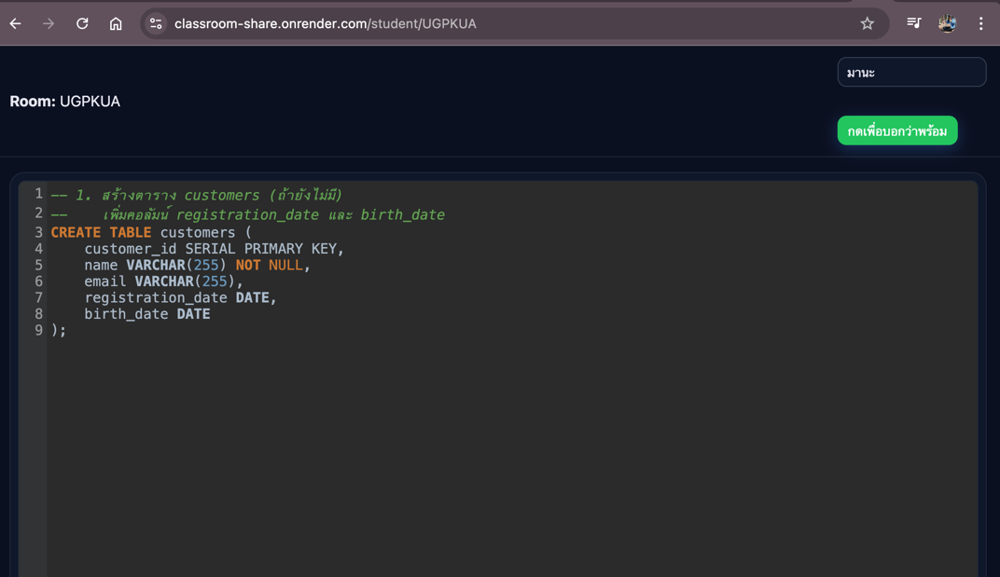

### Share code tools generated by ChatGPT

```prompt
#prompt

ช่วยเขียนระบบแชร์ code ให้นักเรียนในห้องเรียน โดยที่ผู้ใช้งานมี ผู้สอน และ ผู้เรียน โดยที่
- ผู้สอนสร้างห้องได้และจะได้ link มาให้นักเรียน
- นักเรียน join ห้องเรียนได้ และต้องใส่ชื่อตัวเองก่อนเสมอ
- นักเรียนสามารถกดปุ่มบอกว่าพร้อม และผู้สอนจะเห็นว่านักเรียนพร้อมก็ต่อเมื่อนักเรียนทุกคนกดปุ่ม
- การแชร์ code นักเรียนไม่สามารถแก้ code ได้
- นักเรียนเห็นการ hilight ของผู้สอน
code เขียนด้วย nodejs express
```


### Teacher

   

### Student
   
   


##### คำแนะนำ
##### code generate ด้วย ChatGPT โดยไม่ได้ผ่านการตรวจสอบความถูกต้องตามมาตรฐาน โปรดใช้วิจารณญาณในการใช้งาน